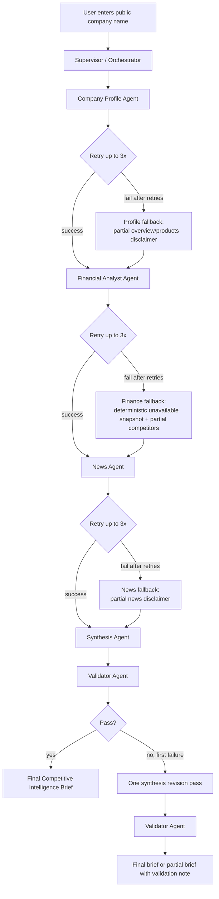

# Architecture Diagram

Chosen topology: `Supervisor-Worker`

Why it fits:
- The supervisor owns routing, retries, aggregation, revision control, and termination.
- Workers stay specialized and do not communicate directly with each other.
- The finance layer is intentionally split so ticker-based `Financial Snapshot` generation is more deterministic than competitor discovery.
- The validator adds a deterministic-envelope layer around the final LLM-generated brief.
