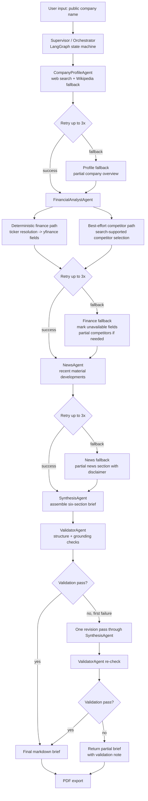

# Architecture Diagram

Chosen topology: `Supervisor-Worker`

Why it fits:
- The supervisor owns routing, retries, aggregation, revision control, and termination.
- Workers stay specialized and do not communicate directly with one another.
- The flow is mostly sequential, which made failure handling and debugging easier than a looser agent-to-agent conversation pattern.
- The finance layer is intentionally split so the `Financial Snapshot` is more deterministic than competitor discovery.
- The validator adds a confidence layer before final output, and the PDF export turns the same generated brief into a more submission-ready artifact.
