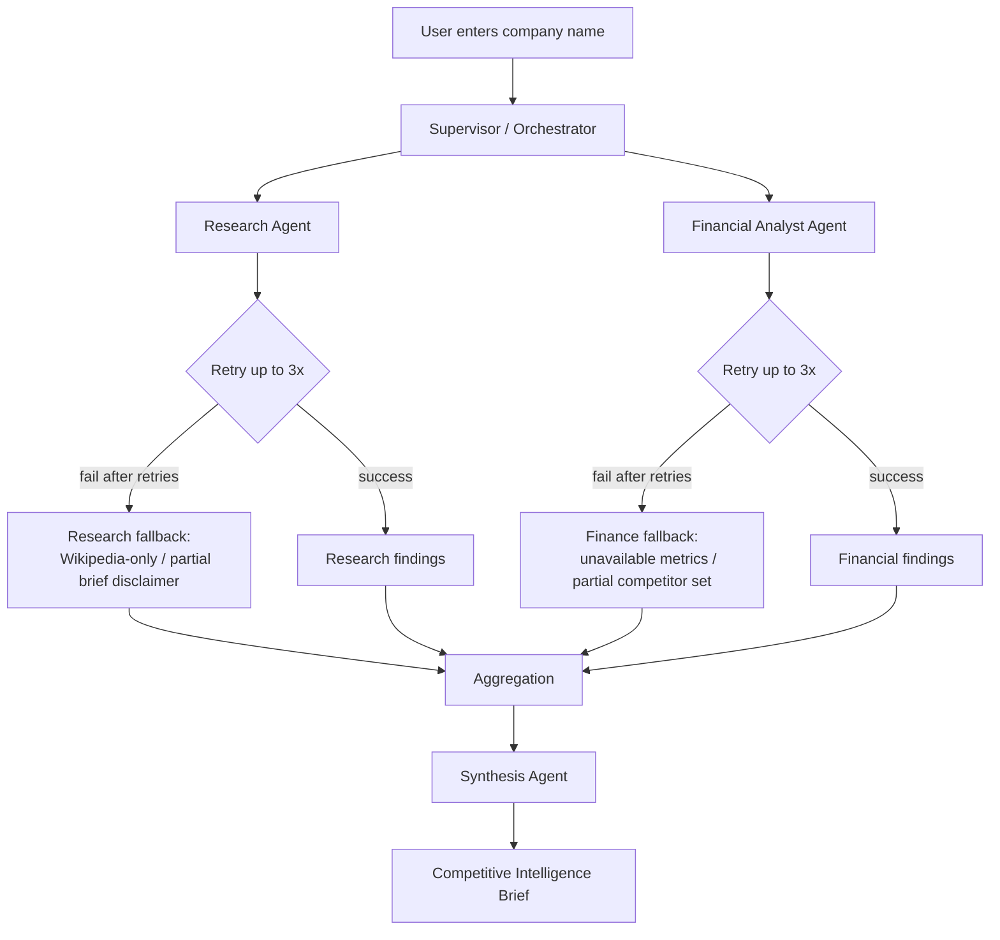

# Architecture Diagram

Chosen topology: `Supervisor-Worker`

Why it fits:
- The supervisor owns routing, aggregation, and termination.
- Workers stay specialized and do not talk directly to each other.
- Retry and fallback happen cleanly at the worker boundary, which matches the lecture's deterministic-envelope framing.

